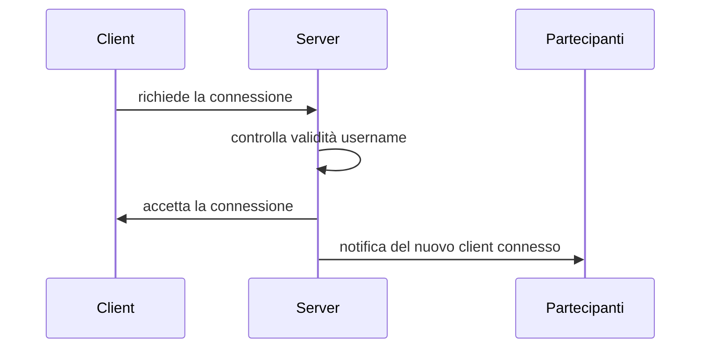
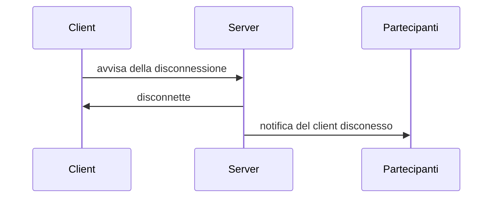
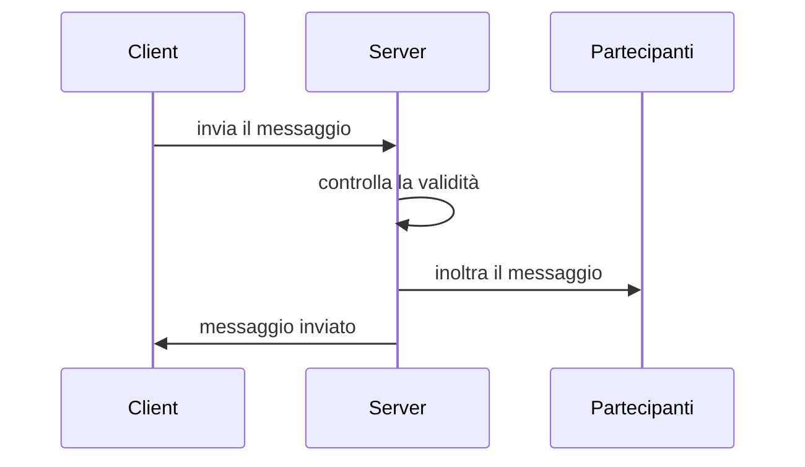
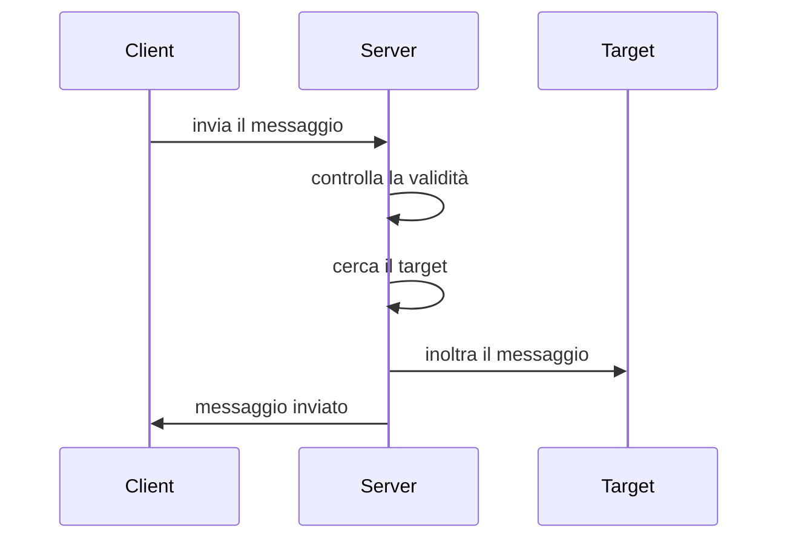

# Java Chat | Leonardo Di Carlo | 5C-IA

## Decrizione
Questo progetto consiste nella creazione di una chatroom che implementa i [Socket](https://it.wikipedia.org/wiki/Socket_(reti)) (livello 4 ISO-OSI) utilizzando il protocollo TCP. Le componenti principali sono due; Client e Server che comunicano in modalità [full duplex](https://it.wikipedia.org/wiki/Duplex#Full-Duplex). I client possono scambiarsi messaggi di testo in [broadcast](https://it.wikipedia.org/wiki/Broadcasting_(informatica)) oppure [unicast](https://it.wikipedia.org/wiki/Unicast).

## Tecnologie Utilizzate
- Java 18 (Maven)
- JSON
- Visual Studio Code

Java 18 è il linguaggio di programmazione utilizzato per lo sviluppo di questo progetto, per facilitare la gestione dello stesso è stato incluso anche [Maven](https://maven.apache.org/), ovvero uno strumento di gestione dei progetti Java.

I dati vengono serializzati e deserializzati in JSON utilizzando la libreria [Jackson](https://github.com/FasterXML/jackson) che permette di parsare JSON per poi istanziare oggetti automaticamente. Questa scelta deriva dal fatto che ultimamente JSON è diventato lo standard per la serializzazione di dati ed è più leggero rispetto all'XML, inoltre essendo popolare ha una grande disponibilità di strumenti.

Come ambiente di sviluppo è consigliato usare [Visual Studio Code](https://code.visualstudio.com/) con le [estensioni](https://marketplace.visualstudio.com/items?itemName=vscjava.vscode-java-pack) per lo sviluppo di Java. Questo progetto include la cartella **.vscode** per installare le estensioni consigliate.

## Architettura Messaggi
I messaggi saranno serializzati interamente in JSON

### Client
Questa sezione definisce tutti gli oggetti che saranno trasmessi dal Client verso il Server

#### Notifica di connessione
Questa notifica verrà inviata dal Client al momento della connessione
```json
{
 "type":"notification",
 "user": "Foo",
 "action": "connect"
}
```
#### Notifica di disconnessione
Questa notifica verrà inviata dal Client al momento della disconnessione
```json
{
 "type":"notification",
 "user": "Foo",
 "action": "disconnect"
}
```

#### Messaggio generico pubblico
In questo caso il client con nome "Foo" sta inviando un messaggio pubblico visibile da tutti
```json
{
 "type":"message",
 "author": "Foo",
 "target": "*",
 "content": "This is an example message"
}
```
#### Messaggio generico privato
In questo caso il client con nome "Foo" sta inviando un messaggio privato che solo "Bar" riceverà
```json
{
 "type":"message",
 "author": "Foo",
 "target": "Bar",
 "content": "This is an example of a private message"
}
```

### Server
Questa sezione definisce tutti gli oggetti che saranno trasmessi dal Server verso il Client

#### Tabella Status
| Status | Significato  |
|:-:|---|
| 200  | Richiesta valida e processata correttamente  |
| 403 | Richiesta valida con parametri non consentiti |
| 422 | Richiesta non valida |

#### Risposta alle notifiche
In questo caso il Server ha accettato la connessione del Client
```json
{
 "status": 200,
 "response": "OK"
}
```
In questo caso il Server ha rifiutato la connessione del Client comunicando il motivo; il nome inserito dall'utente è gia stato utilizzato
```json
{
 "status": 403,
 "response": "This name is already in use, try changing it"
}
```
In questo caso il Server ha rifiutato la connessione del Client comunicando il motivo; 
il formato della richiesta è errato
```json
{
 "status": 422,
 "response": "Could not parse request object"
}
```

### Risposta ai messaggi
In questo caso il Server ha ricevuto il messaggio dal Client e l'ha inoltrato al target
```json
{
 "status": 200,
 "response": "OK"
}
```
In questo caso il Server ha ricevuto il messaggio dal Client ma non è riuscito ad inoltrarlo al client.
Questa condizione potrebbe verificarsi quando solo un client è connesso oppure quando il target non esiste
```json
{
 "status": 404,
 "response": "Target not found, the specified target may not exist or you're the only client connected"
}
```

## Diagrammi di sequenza

### Diagramma della connessione

---
### Diagramma della disconnessione

---
### Diagramma del messaggio pubblico

---
### Diagramma del messaggio privato

## Diagrammi delle classi

### Client
to do...